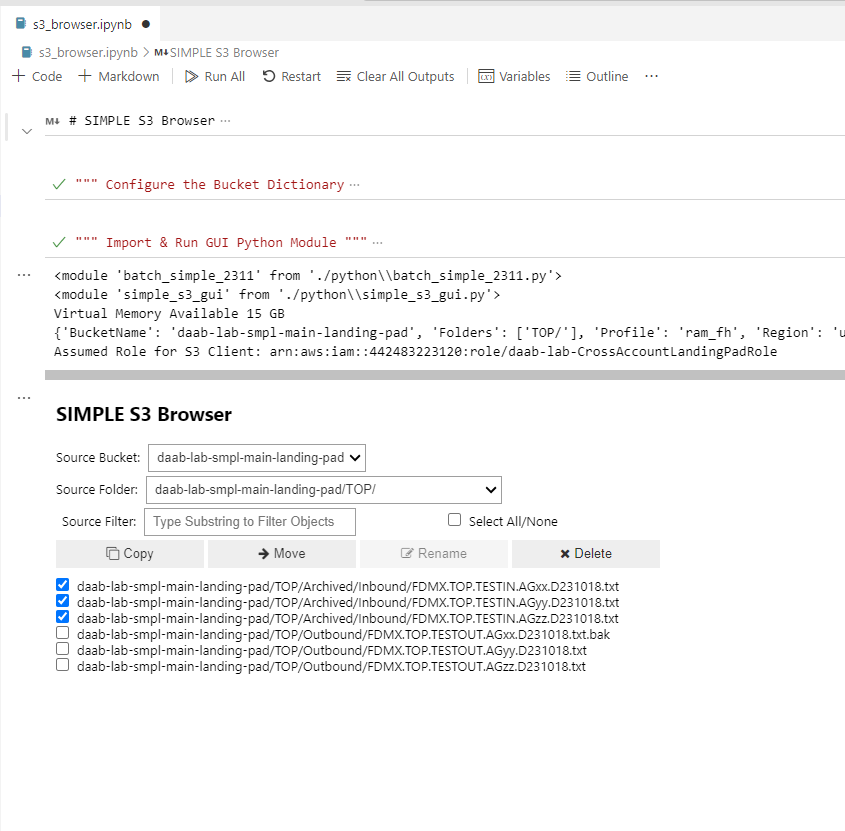
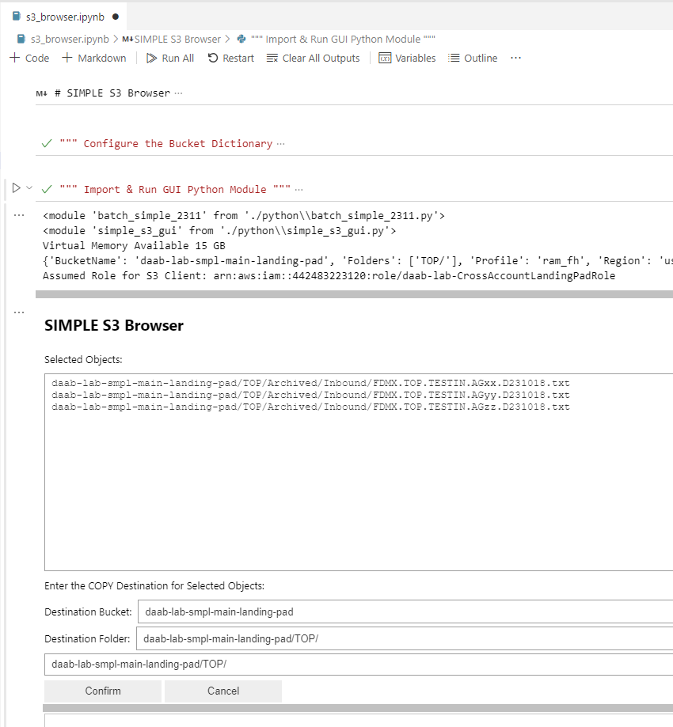

# SIMPLE S3 Browser
The standard Amazon S3 Console is oriented toward viewing and managing all buckets within a particular IAM Sign-in account.  Granting users S3 Console access in multiple accounts is cumbersome, and fraught with security concerns, when all that users really need is access to a set of particular subfolders within particular buckets.  This project provides a basic GUI that enables the user to view and manage S3 Objects among multiple buckets which can reside different accounts.

- [s3_browser.ipynb](./s3_browser.ipynb) -- Jupyter Notebook to configure buckets and invoke the GUI application
- [python/batch_simple_2311.py](./python/batch_simple_2311.py) -- Common Python module containing S3 help functions, among other things used by SIMPLE projects.
- [python/simple_s3_gui.py](./python/simple_s3_gui.py) -- Basic GUI implemented using [ipywidgets]( https://ipywidgets.readthedocs.io/en/stable/index.html)

## Usage

1. Clone this repository into your Jupyter Notebook environment.   This was built and tested with VS Code, but should work anywhere.  You might need to 'pip install' some packages.

1. Open [s3_browser.ipynb](./s3_browser.ipynb) and configure the Bucket Dictionary with the set of buckets and folders you need to work with.

1. Select Source Objects
    - Select 'bucket/folder' from **Source Bucket** drop down list box
    - Optionally, select 'subfolder' from **Source Folder** drop down list box to filter results
    - Optionally, type substring in **Source Filter** to match any part of object names to filter results
    - Check **Select All/None** to select or deselect all the listed objects
    - Click an operation button to proceed
        - **Copy** selected objects from source to destination folder
        - **Move** selected objects from source to destination folder, then delete source objects
        - **Rename** one selected object within its current folder 
        - **Delete** selected objects from source (WARNING: permanent, unless S3 versioning is configured)

    

    

1.  Specify Destination and Confirm Action

    - Review the **Selected Objects** 
    - Select 'bucket/folder' from **Destination Bucket** drop down list box
    - Optionally, select 'subfolder' from **Destination Folder** drop down list box 
    - Optionally for COPY or MOVE, modify destination folder in **Input Textbox** 
        - NOTE: destination folder must end with '/'
    - For RENAME, modify **Input Textbox** to new object name
    - Click an operation button to proceed
        - **Confirm** to perform specified operation.
        - **Cancel** to return to 'Select Source Objects' without performing specified operation.

    )

## Note
- SIMPLE S3 Browser is intended to support Dev and Test operations involving a limited set of files.  (i.e., dozens, maybe hundreds, not thousands).   If you find the GUI bogging down retreiving big object lists, specify a more limited subfolder in your Bucket Dictionary.  Or, you can script your lotsa files use case with the provided [python/batch_simple_2311.py](./python/batch_simple_2311.py) module.

